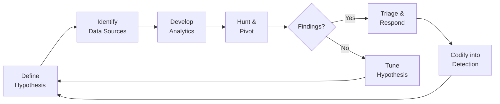

<div align="center">


<br/><br/>

*A living library for proactive defense — built around the ELK stack, MITRE ATT&CK, and the discipline of asking "what would I see if the adversary were already inside?"*

[](LICENSE)
[](https://www.elastic.co/security)
[](https://attack.mitre.org/)
[](https://github.com/SigmaHQ/sigma)
[](#contributing)


</div>

---

## Why this repo exists

> *"Detection is what you wrote down yesterday. Hunting is what you don't know yet."*

This is my open notebook for threat hunting work — hypotheses I've tested, detection logic I've shipped, Medium write-ups, and the references that shaped how I think. If you're an analyst, detection engineer, or blue-teamer building your own craft, take what's useful and leave what isn't.

The goal is **practical, ELK-first, ATT&CK-aligned** material — not theory for theory's sake.

---

## Table of contents

- [Repository structure](#repository-structure)
- [The hunting cycle](#the-hunting-cycle)
- [Hypotheses](#hypotheses)
- [Detection rules](#detection-rules)
- [Write-ups & articles](#write-ups--articles)
- [Resources](#resources)
- [Tooling cheatsheet](#tooling-cheatsheet)
- [Hunt log](#hunt-log)
- [Contributing](#contributing)
- [Connect](#connect)

---

## Repository structure

```text
Threat_hunting/
├── hypotheses/             # ATT&CK-aligned hunt hypotheses (one per file)
│   ├── credential-access/
│   ├── defense-evasion/
│   ├── execution/
│   ├── lateral-movement/
│   └── persistence/
├── rules/                  # Production-ready detection logic
│   ├── elastic/            # EQL, KQL, ES|QL
│   ├── sigma/              # Vendor-agnostic Sigma rules
│   └── yara/               # File / memory signatures
├── notebooks/              # Jupyter notebooks for data-driven hunts
├── playbooks/              # Step-by-step IR + hunting playbooks
├── writeups/               # Long-form Medium / blog drafts
├── datasets/               # Sample logs, replay packs, lab artifacts
├── resources/              # Curated reading, courses, podcasts
└── README.md
```

---

## The hunting cycle



Every hunt that surfaces a repeatable signal graduates into `rules/`. Once it's a detection, the cycle restarts with a new hypothesis.

---

## Hypotheses

Each hunt in this repo follows the same template — so anyone can run it, falsify it, or improve it.

| ID    | Title                                                | Tactic (ATT&CK)            | Status         |
| ----- | ---------------------------------------------------- | -------------------------- | -------------- |
| H-001 | Suspicious WMI event subscription persistence        | TA0003 Persistence         | Productionized |
| H-002 | LSASS access from unusual parent process             | TA0006 Credential Access   | Hunting        |
| H-003 | DNS tunneling via long / high-entropy subdomains     | TA0011 C2                  | Hunting        |
| H-004 | Service binary path quoting abuse                    | TA0004 Privilege Escalation| Draft          |
| H-005 | Scheduled task created by non-admin user             | TA0003 Persistence         | Draft          |

> Browse the full catalogue in [`/hypotheses`](./hypotheses).

### Hypothesis template

```yaml
id: H-XXX
title: Short, falsifiable statement
tactic: TA0XXX
technique: TXXXX[.XXX]
data_sources:
  - Windows Event Logs (4688, 4624)
  - Sysmon (Event ID 1, 3, 11)
  - EDR process telemetry
hypothesis: |
  If an adversary is using <technique>, we should observe <signal>
  in <data source> within <time window>.
hunt_query: |
  # ES|QL / KQL / Splunk SPL / etc.
expected_results:        # what "normal" looks like
known_false_positives:   # noisy cases up front
references:
  - https://attack.mitre.org/techniques/TXXXX/
```

---

## Detection rules

Rules are versioned, tagged with ATT&CK, and ship with test data plus a tuning guide.

| Format                  | Count | Path                                |
| ----------------------- | ----- | ----------------------------------- |
| Elastic (EQL / ES\|QL)  | —     | [`rules/elastic`](./rules/elastic)  |
| Sigma                   | —     | [`rules/sigma`](./rules/sigma)      |
| YARA                    | —     | [`rules/yara`](./rules/yara)        |

Every rule carries:

- **Confidence:** Low / Medium / High
- **Noise rating:** how many alerts/day in a 1k-endpoint estate
- **ATT&CK mapping:** tactic + technique IDs
- **Test data:** replay-able sample log so the rule is reproducible

---

## Write-ups & articles

Long-form deep dives — usually mirrored to Medium.

| Title                                                | Topic         | Link              |
| ---------------------------------------------------- | ------------- | ----------------- |
| *Hunting WMI persistence in Elastic*                 | Persistence   | [Medium →](#)     |
| *From hypothesis to detection: a worked example*     | Methodology   | [Medium →](#)     |
| *Sysmon configs that actually pay off*               | Telemetry     | [Medium →](#)     |
| *ES\|QL for hunters: patterns I keep reaching for*   | Query craft   | [Medium →](#)     |

> Follow [@v3nomtech on Medium](#) for new drops.

---

## Resources

The shortlist I'd hand to a new analyst on day one.

### Frameworks & methodology
- [MITRE ATT&CK](https://attack.mitre.org/) — the lingua franca
- [PEAK Threat Hunting Framework (Splunk)](https://www.splunk.com/en_us/blog/security/peak-threat-hunting-framework.html)
- [TaHiTI Hunting Methodology](https://www.betaalvereniging.nl/en/safety/tahiti/)
- [Sqrrl's Hunting Maturity Model](https://www.threathunting.net/files/hunt-evil-practical-guide-threat-hunting.pdf)
- [The Diamond Model of Intrusion Analysis](https://www.activeresponse.org/wp-content/uploads/2013/07/diamond.pdf)
- [Pyramid of Pain — David Bianco](https://detect-respond.blogspot.com/2013/03/the-pyramid-of-pain.html)

### Books worth your time
- *Practical Threat Intelligence and Data-Driven Threat Hunting* — Valentina Costa-Gazcón
- *Intelligence-Driven Incident Response* — Roberts & Brown
- *The Cuckoo's Egg* — Cliff Stoll (yes, really)
- *Applied Network Security Monitoring* — Sanders & Smith

### Free training
- [Active Countermeasures Threat Hunter Training](https://www.activecountermeasures.com/free-tools/)
- [SANS Threat Hunting Posters](https://www.sans.org/posters/?focus-area=digital-forensics)
- [The DFIR Report](https://thedfirreport.com/) — read every single one
- [Elastic Security Labs research](https://www.elastic.co/security-labs)

### Blogs to follow
- [Elastic Security Labs](https://www.elastic.co/security-labs)
- [Red Canary](https://redcanary.com/blog/)
- [The DFIR Report](https://thedfirreport.com/)
- [SpecterOps Posts](https://posts.specterops.io/)
- [Huntress Blog](https://www.huntress.com/blog)
- [Mandiant Threat Research](https://www.mandiant.com/resources/blog)

### Datasets for practicing
- [Security Datasets (formerly Mordor)](https://securitydatasets.com/)
- [BOSS of the SOC — Splunk](https://github.com/splunk/botsv3)
- [EVTX-ATTACK-SAMPLES](https://github.com/sbousseaden/EVTX-ATTACK-SAMPLES)
- [Atomic Red Team](https://github.com/redcanaryco/atomic-red-team)
- [DetectionLab](https://detectionlab.network/)

---

## Tooling cheatsheet

| Need                              | Tool                                                       |
| --------------------------------- | ---------------------------------------------------------- |
| Search & visualize                | Elastic / Kibana, Splunk                                   |
| Endpoint telemetry                | Sysmon, Auditd, osquery, EDR of choice                     |
| Generate adversary activity       | Atomic Red Team, Caldera, Stratus Red Team                 |
| Sigma → backend conversion        | `sigmac`, pySigma                                          |
| Notebooks                         | Jupyter + [msticpy](https://github.com/microsoft/msticpy)  |
| Enrichment                        | VirusTotal, OTX, MISP, GreyNoise                           |
| Lab / detonation                  | DetectionLab, FlareVM, REMnux                              |

---

## Hunt log

A rolling log of what was hunted, when, and what came out of it. Transparency over polish.

| Date       | Hunt ID | Outcome                                 | Detection shipped? |
| ---------- | ------- | --------------------------------------- | ------------------ |
| 2026-05-01 | H-001   | 2 true positives, tuned out 1 FP source | Yes — `elastic/wmi-subscription.eql` |
| 2026-04-22 | H-002   | No findings; lowered confidence to M    | Pending            |
| 2026-04-10 | H-003   | Baseline established, 0 anomalies       | No                 |

---

## Contributing

Found a bug? Have a better hypothesis? Open an issue or PR.

1. **Fork** the repo
2. **Add** your hypothesis or rule under the right folder
3. **Use the template** — consistency makes this useful for everyone
4. **Open a PR** with the ATT&CK ID in the title (e.g. `[T1547.001] Registry Run Key persistence hunt`)

All contributions are released under the repo's license.

---

## Roadmap

- [x] Set up repository structure
- [ ] Publish first 10 hypotheses with full templates
- [ ] Ship Elastic detection rule pack v0.1
- [ ] Add Jupyter notebooks for top-5 hunts
- [ ] Cross-publish 3 write-ups on Medium
- [ ] Build a CI check that validates new hypotheses against the template
- [ ] Add a Sigma → Elastic auto-conversion workflow

---

## Connect

- **GitHub:** [@v3nomtech](https://github.com/v3nomtech)
- **Medium:** *coming soon*
- **LinkedIn:** *coming soon*

> If something here saved you time, a star costs you nothing.

---

<div align="center">
<sub>Built with caffeine and false positives. Maintained by <a href="https://github.com/v3nomtech">@v3nomtech</a>.</sub>
</div>
