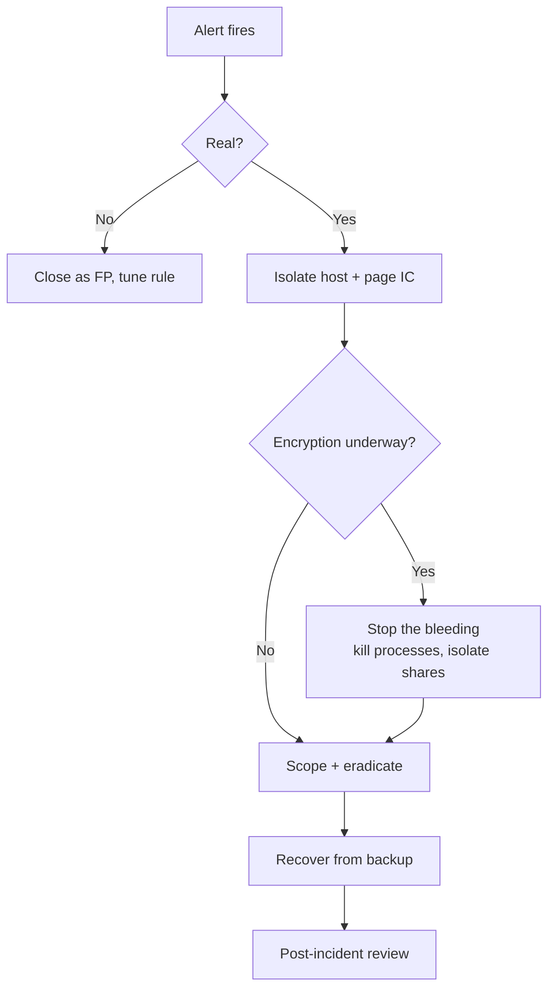

# PB-001 — Ransomware Pre-Encryption Triage

| Field        | Value                                                              |
| ------------ | ------------------------------------------------------------------ |
| ID           | PB-001                                                             |
| Title        | Ransomware pre-encryption triage                                   |
| Author       | v3nomtech                                                          |
| Created      | 2026-05-12                                                         |
| Last updated | 2026-05-12                                                         |
| Status       | Stable                                                             |
| Related      | [H-013 — Shadow copy deletion](../hypotheses/impact/H-013-shadow-copy-deletion.yml) |

> **Use this when:** a detection fires that indicates a host is preparing to
> encrypt — shadow-copy deletion, Defender exclusions added, mass file
> renames staged, or known ransomware tooling observed. **Goal: contain
> within 10 minutes of the first alert.**

---

## 0 · Pre-flight (≤ 60 seconds)

- [ ] Confirm the alert is from a known sensor (not a test / drill).
- [ ] Page the on-call incident lead. Open a war-room channel.
- [ ] Identify the **host(s)**, **user(s)**, and **first-seen timestamp**.

---

## 1 · Contain (≤ 5 minutes)

- [ ] **Isolate** the affected host via EDR network-quarantine (do NOT
      power off — we still need volatile evidence).
- [ ] If the user account is interactive, **disable** it in AD and revoke
      Kerberos tickets (`Reset-ADAccount`, then force a TGT refresh).
- [ ] Check for additional hosts touched by the same user / source IP in
      the last 24h. Isolate any that match.
- [ ] Snapshot any affected VMs / cloud instances (do not delete originals).

---

## 2 · Scope (≤ 15 minutes)

Pull these in parallel:

- [ ] **Process tree** from the suspect host for the last 4 hours.
- [ ] **Network connections** out of the host for the last 24 hours.
- [ ] **Authentication events** for the user across the estate (last 7d).
- [ ] **File-write rate** on the host — is encryption already underway?
- [ ] **Persistence inventory** — scheduled tasks, run keys, services,
      WMI subscriptions added in the last 24h.

ES|QL starter — file-write rate by host in last hour:

```esql
FROM logs-endpoint.events.file-*
| WHERE event.action == "creation" AND @timestamp > NOW() - 1 hour
| STATS writes = COUNT(*) BY host.name, BUCKET(@timestamp, 1m)
| WHERE writes > 500
| SORT writes DESC
```

---

## 3 · Eradicate (≤ 60 minutes)

- [ ] Kill the offending process tree on isolated host(s).
- [ ] Remove persistence artifacts identified in step 2.
- [ ] Rotate **all credentials** the user had access to (passwords, API
      tokens, signed SSH keys, cloud access keys).
- [ ] If LSASS access was observed, rotate credentials for every account
      that has logged onto the host in the last 30 days.
- [ ] Block known C2 IPs / domains at the egress firewall and DNS sinkhole.

---

## 4 · Recover

- [ ] Validate backups for affected systems exist and are not on the same
      AD domain / share that was reached.
- [ ] Restore from a backup that **predates** the first observed
      reconnaissance — not just first encryption.
- [ ] Re-image rather than clean if there is any doubt about full eviction.
- [ ] Re-enable users after credential rotation + MFA reset.

---

## 5 · Post-incident (within 5 business days)

- [ ] Write the timeline: first signal → detection → containment → recovery.
- [ ] Identify the **initial access vector** (phish? exposed RDP? supply chain?).
- [ ] File any new hypotheses surfaced during the incident under the
      relevant tactic folder.
- [ ] Promote anything detection-worthy to `rules/`.
- [ ] Update this playbook with whatever you learned.

---

## Decision tree



---

## References

- [MITRE ATT&CK — TA0040 Impact](https://attack.mitre.org/tactics/TA0040/)
- [The DFIR Report — ransomware case studies](https://thedfirreport.com/)
- [CISA #StopRansomware guide](https://www.cisa.gov/stopransomware)
